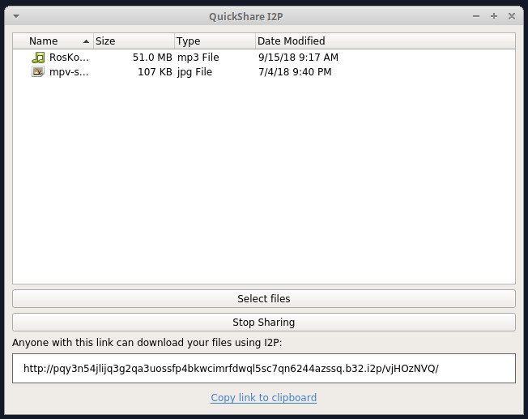

QuickShare
==========

Share files quickly and anonymously over the I2P network.

This basic python application runs a hidden I2P website on your computer, which 
allows other users of the I2P network to download your files. 

It is intentionally a very basic script with minimal dependencies.

Requirements
------------

- I2P router with SAM API enabled
- Python >= 3.5
- PyQT5 (apt install python3-pyqt5)
- i2plib (pip3 install --user i2plib)

Aknowledgments
--------------

This script uses some code from the [OnionShare](https://onionshare.org/) project.
